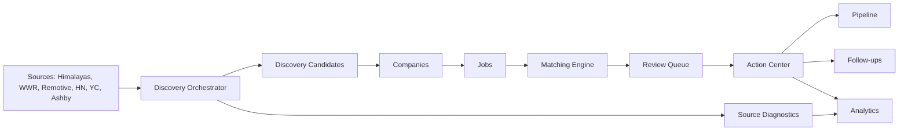

# ScoutAI Architecture

ScoutAI is a local-first job-search intelligence system with a FastAPI backend, PostgreSQL database, source-specific discovery/enrichment services, deterministic matching, and a Next.js frontend.

## Frontend
- Next.js application in `frontend/`.
- React Query handles API fetching and refetching.
- Local workflow state is used for follow-ups, cold DM drafts, resume-fit cache, Daily Operating Loop state, and export helpers.
- Major surfaces include Command Center, Discovery Control Center, Review Queue, Action Center, Pipeline, Watchlist, Follow-ups, Resume, and Analytics.

## Backend
- FastAPI application in `backend/app/`.
- PostgreSQL is the source of truth for companies, jobs, matches, decisions, resumes, discovery runs, and backend-backed application artifacts.
- Alembic manages schema migrations.

## Discovery Sources
- Himalayas
- We Work Remotely
- Remotive
- Hacker News
- Y Combinator
- Ashby
- First-party job pages where supported

## Enrichment Layer
Company and job enrichment normalizes raw source data into durable company and job records. Enrichment stays conservative and keeps source diagnostics visible when data is incomplete or noisy.

## Matching Engine
The matching layer scores jobs against the current profile with deterministic rules for role fit, seniority, experience, remote eligibility, actionability, and missing information.

## Application Workflow
The frontend turns matched jobs into user action:
- Review Queue
- Resume-aware ranking
- Application Action Center
- Application Pack export
- Cold DM Draft Builder
- Follow-up Tracker
- Pipeline
- Analytics

## LocalStorage-only Features
Some workflow helpers are intentionally local-first:
- Cold DM drafts
- Follow-up tracker entries
- Resume-fit cache
- Daily Operating Loop state
- Some export/session state

These do not replace backend persistence for core entities like jobs, companies, matches, decisions, discovery runs, and resumes.

## Source Diagnostics
Discovery runs store and display source-level diagnostics such as records seen, jobs created, jobs existing, jobs enriched, jobs scored, failures, warnings, duration, and source quality.

## Data Flow

